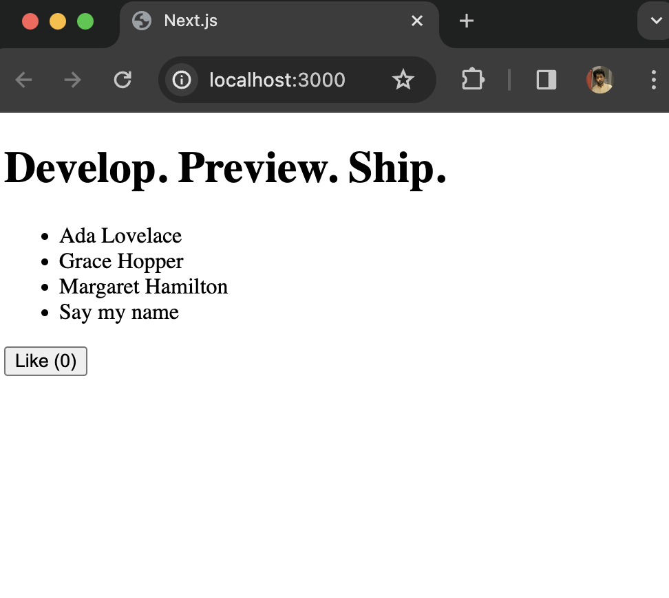

### I have stored a project of NEXTJS here during doing a [course](https://nextjs.org/learn/react-foundations) from nextjs.org
 
This course helped me to familierzie with NEXTjs framwork and learn how to run a code in server as well as in client side via using the power of NEXTjs.

here is the reference of completion...

  
And here is the generate output...
  
